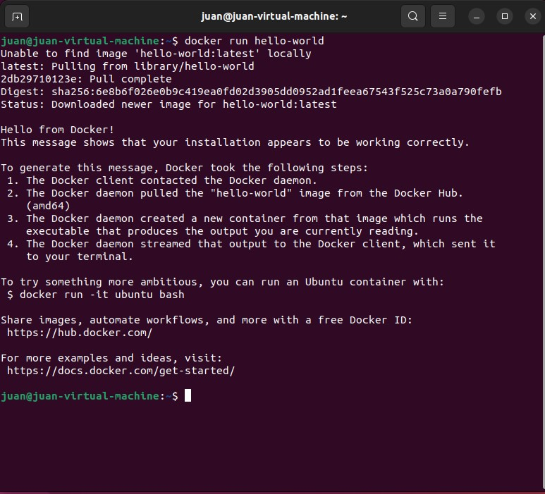

# Prática 2 - DOCKER

## Primera parte: Lleva a cabo la práctica descrita en el primer artículo
- Ejecuta la imagen "hello-world"

```bash
docker run hello-world
```



- Muestra las imágenes Docker instaladas

```bash
docker images
```


- Muestra los contenedores Docker

```bash
docker ps -a
```


## Lleva a cabo la práctica descrita en el segundo artículo

Clonamos el repositorio get-started 

```bash
git clone https://github.com/docker/getting-started.git
```

Nos situamos en el directorio:

```bash
cd getting-started/app
```
Creamos el archivo DockerFile

```bash
touch Dockerfile
```

- Edita el fichero Dockerfile

Lo editamos desde Visual Studio Code y añadimos lo siguiente: 


- Construye el contenedor

```bash
docker build -t getting-started .
```

- Ejecútalo

```bash
docker run -dp 3000:3000 getting-started
```


- Create una cuenta en hub.docker.com


- Publícalo

```bash
docker tag getting-started jotabro/getting-started
```

```bash
docker push jotabro/getting-started
```


