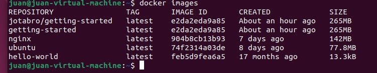
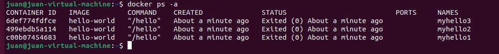
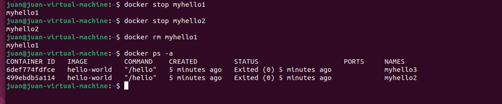
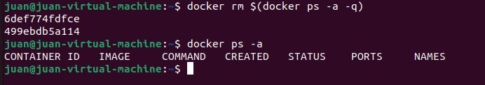

## Practica 3 

Descarga la imagen de ubuntu

```bash
 docker pull ubuntu
```


Descarga la imagen de hello-world

```bash
 docker pull hello-world
```

Descarga la imagen nginx

```bash
 docker pull nginx
```

Muestra un listado de todas la imágenes

```bash
 docker images
```




Ejecuta un contenedor hello-world y dale nombre “myhello1”

```bash
docker run -d --myhello1 hello-world
```

Ejecuta un contenedor hello-world y dale nombre “myhello2”

```bash
docker run -d --myhello2 hello-world
```

Ejecuta un contenedor hello-world y dale nombre “myhello3”
```bash
docker run -d --myhello3 hello-world
```


Muestra los contenedores que se están ejecutando

```bash
docker ps -a
```




Para el contenedor "myhello1”

```bash
docker stop myhello1
```

Para el contenedor "myhello2”

```bash
docker stop myhello2
```

Borra el contenedor “myhello1”

```bash
docker rm myhello1
```


Muestra los contenedores que se están ejecutando.




Borra todos los contenedores

```bash
docker stop $(docker ps -a -q)
```

```bash
docker rm $(docker ps -a -q)
```


