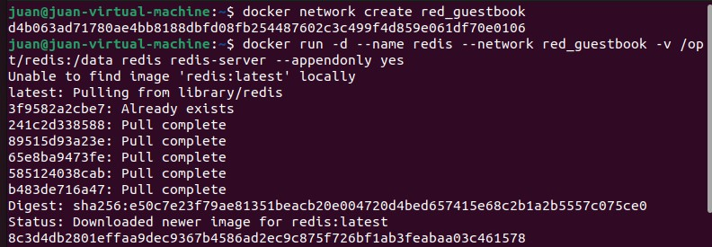
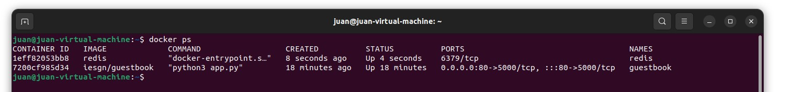
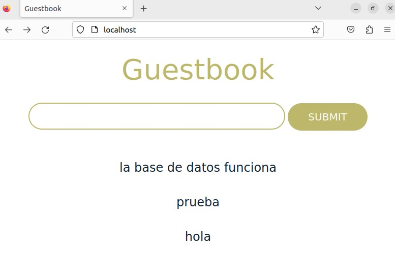

## Ejemplo 1: Despliegue de la aplicación Guestbook

La aplicación guestbook por defecto utiliza el nombre redis para conectarse a la base de datos, por lo tanto debemos nombrar al contenedor redis con ese nombre para que tengamos una resolución de nombres adecuada.

Los dos contenedores tienen que estar en la misma red y deben tener acceso por nombres (resolución DNS) ya que de principio no sabemos que ip va a coger cada contenedor. Por lo tanto vamos a crear los contenedores en la misma red:

```bash
$ docker network create red_guestbook
```


```bash
$ docker run -d --name redis --network red_guestbook -v /opt/redis:/data redis redis-server --appendonly yes
```
```bash
$ docker run -d -p 80:5000 --name guestbook --network red_guestbook iesgn/guestbook
```



Probamos y vemos que funciona, conectando con la base de datos




