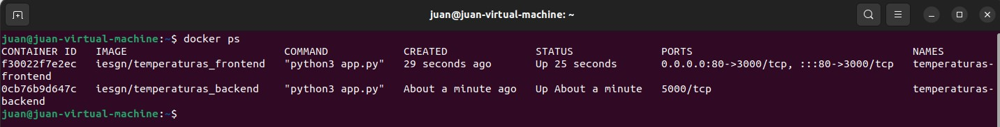
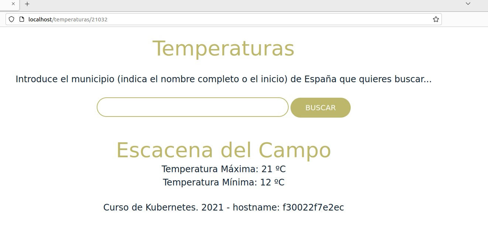
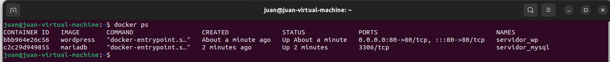
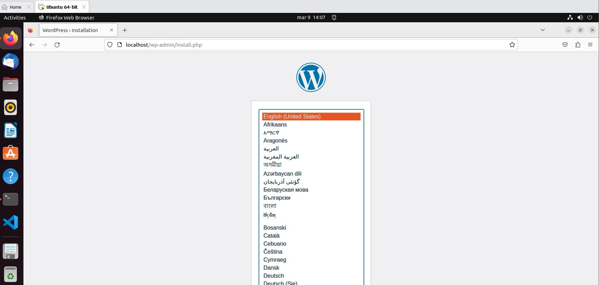

## Ejemplo 1: Despliegue de la aplicación Guestbook

La aplicación guestbook por defecto utiliza el nombre redis para conectarse a la base de datos, por lo tanto debemos nombrar al contenedor redis con ese nombre para que tengamos una resolución de nombres adecuada.

Los dos contenedores tienen que estar en la misma red y deben tener acceso por nombres (resolución DNS) ya que de principio no sabemos que ip va a coger cada contenedor. Por lo tanto vamos a crear los contenedores en la misma red:

```bash
$ docker network create red_guestbook
```


```bash
$ docker run -d --name redis --network red_guestbook -v /opt/redis:/data redis redis-server --appendonly yes
```
```bash
$ docker run -d -p 80:5000 --name guestbook --network red_guestbook iesgn/guestbook
```


Probamos y vemos que funciona, conectando con la base de datos


## Ejemplo 2: Despliegue de la aplicación Temperaturas

Vamos a hacer un despliegue completo de una aplicación llamada Temperaturas. Esta aplicación nos permite consultar la temperatura mínima y máxima de todos los municipios de España. 

Vamos a crear una red para conectar los dos contenedores:

```bash
$ docker network create red_temperaturas
```

Ejecutamos los contenedores:

```bash
$ docker run -d --name temperaturas-backend --network red_temperaturas iesgn/temperaturas_backend

$ docker run -d -p 80:3000 --name temperaturas-frontend --network red_temperaturas iesgn/temperaturas_frontend
```



La aplicación en funcionamiento: 




##Ejemplo 3: Despliegue de Wordpress + mariadb

Para la instalación de WordPress necesitamos dos contenedores: la base de datos (imagen mariadb) y el servidor web con la aplicación (imagen wordpress). Los dos contenedores tienen que estar en la misma red y deben tener acceso por nombres (resolución DNS) ya que de principio no sabemos que ip va a coger cada contenedor. Por lo tanto vamos a crear los contenedores en la misma red:

```bash
$ docker network create red_wp
```

```bash
$ docker run -d --name servidor_mysql \
                --network red_wp \
                -v /opt/mysql_wp:/var/lib/mysql \
                -e MYSQL_DATABASE=bd_wp \
                -e MYSQL_USER=user_wp \
                -e MYSQL_PASSWORD=asdasd \
                -e MYSQL_ROOT_PASSWORD=asdasd \
                mariadb
                
$ docker run -d --name servidor_wp \
                --network red_wp \
                -v /opt/wordpress:/var/www/html/wp-content \
                -e WORDPRESS_DB_HOST=servidor_mysql \
                -e WORDPRESS_DB_USER=user_wp \
                -e WORDPRESS_DB_PASSWORD=asdasd \
                -e WORDPRESS_DB_NAME=bd_wp \
                -p 80:80 \
                wordpress

$ docker ps
CONTAINER ID        IMAGE               COMMAND                  CREATED             STATUS              PORTS                NAMES
5b2c5a82a524        wordpress           "docker-entrypoint.s…"   9 minutes ago       Up 9 minutes        0.0.0.0:80->80/tcp   servidor_wp
f70f22aed3d1        mariadb             "docker-entrypoint.s…"   9 minutes ago       Up 9 minutes        3306/tcp             servidor_mysql

```



Ejecutamos la aplicación y ya tenemos wordpress listo para funcionar:




