## COMPOSE 

 ## Instalación de docker-compose

```bash
apt install docker-compose
```

Crearemos también un archivo docker-compose.yml donde añadires el código necesario para desplegar el conjunto de contenedores y servicios que necesitemos.

## Ejemplo 1 - Guestbook

Añadiremos a docker-compose.yml:

```bash
version: '3.1'
services:
  app:
    container_name: guestbook
    image: iesgn/guestbook
    restart: always
    ports:
      - 80:5000
  db:
    container_name: redis
    image: redis
    restart: always
```

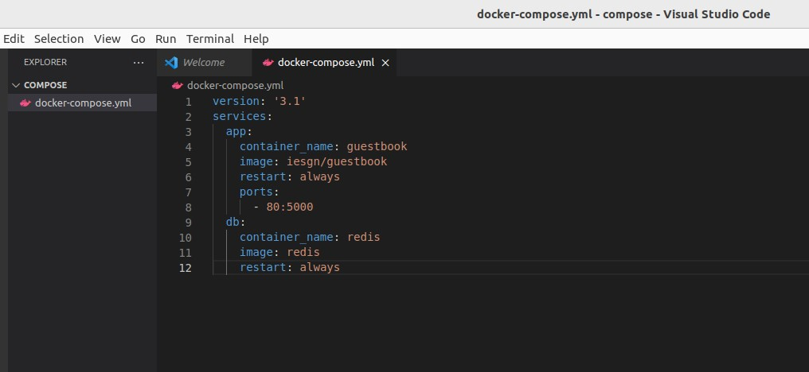

Creamos el escenario:

```bash
$ docker-compose up -d
```

Comprobamos los contenedores:

```bash
$ docker-compose ps
```
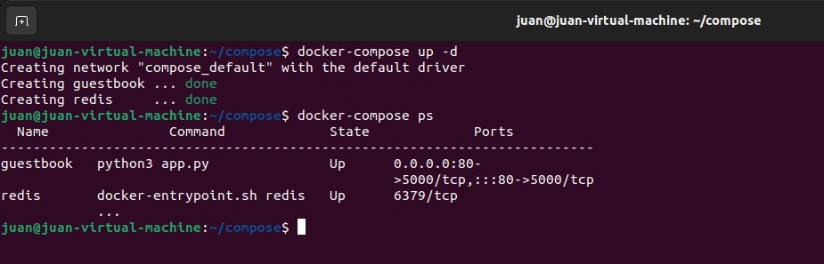

Por último comprobamos el despligue de la aplicación en nuestro navegador:

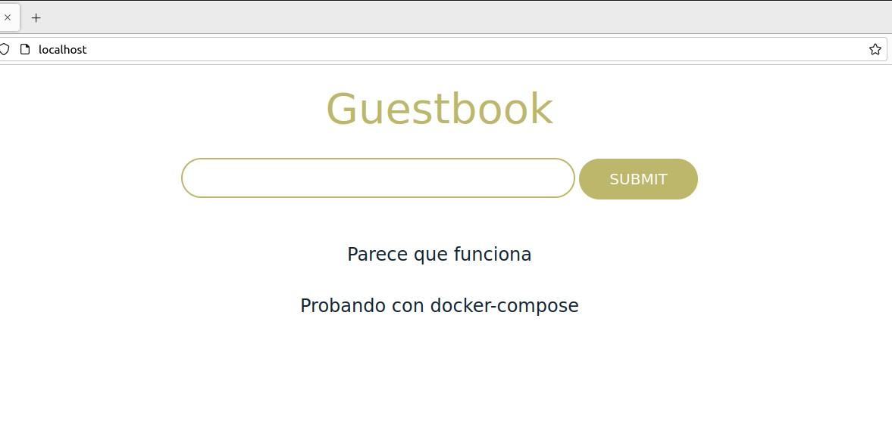

Luego para parar los contenedores:

```bash
$ docker-compose stop 
```

Y para eliminar el escenario:

```bash
$ docker-compose down
```

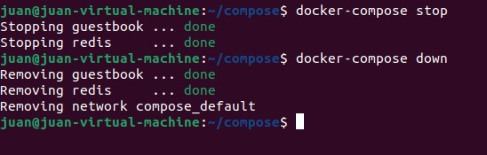


## Ejemplo 2 - Temperaturas

Añadiremos a docker-compose.yml:

```bash
version: '3.1'
services:
  frontend:
    container_name: temperaturas-frontend
    image: iesgn/temperaturas_frontend
    restart: always
    ports:
      - 80:3000
    depends_on:
      - backend
  backend:
    container_name: temperaturas-backend
    image: iesgn/temperaturas_backend
    restart: always


```

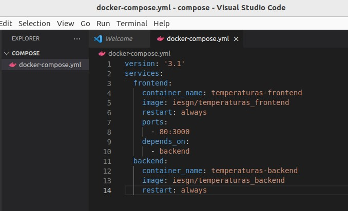

Creamos el escenario:

```bash
$ docker-compose up -d

```

Comprobamos los contenedores:

```bash
$ docker-compose ps
```
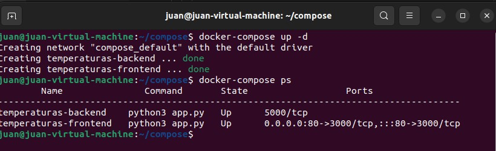

Por último comprobamos el despligue de la aplicación en nuestro navegador:

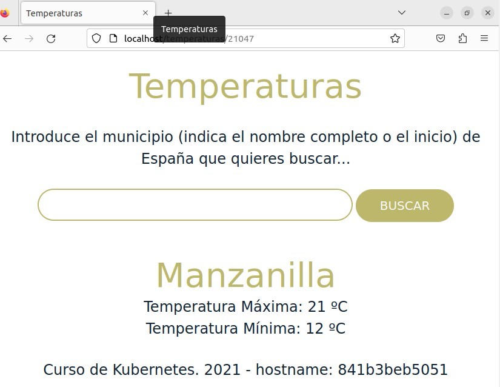

Luego para parar los contenedores:

```bash
$ docker-compose stop 
```

Y para eliminar el escenario:

```bash
$ docker-compose down
```

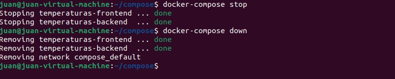


## Ejemplo 3 - Wordpress

Añadiremos a docker-compose.yml:

```bash

version: '3.1'
services:
  wordpress:
    container_name: servidor_wp
    image: wordpress
    restart: always
    environment:
      WORDPRESS_DB_HOST: db
      WORDPRESS_DB_USER: user_wp
      WORDPRESS_DB_PASSWORD: asdasd
      WORDPRESS_DB_NAME: bd_wp
    ports:
      - 80:80
    volumes:
      - wordpress_data:/var/www/html/wp-content
  db:
    container_name: servidor_mysql
    image: mariadb
    restart: always
    environment:
      MYSQL_DATABASE: bd_wp
      MYSQL_USER: user_wp
      MYSQL_PASSWORD: asdasd
      MYSQL_ROOT_PASSWORD: asdasd
    volumes:
      - mariadb_data:/var/lib/mysql
volumes:
    wordpress_data:
    mariadb_data:

```

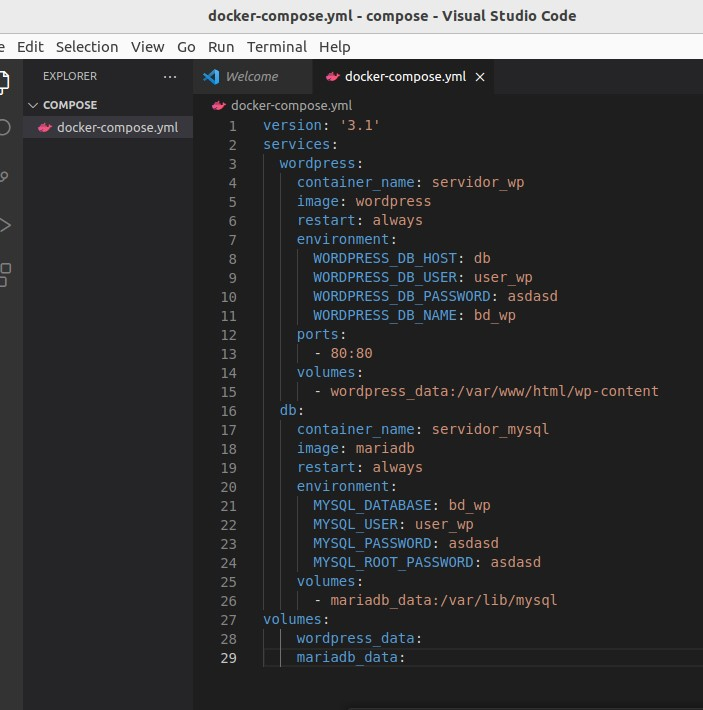

Creamos el escenario:

```bash
$ docker-compose up -d

```

Comprobamos los contenedores:

```bash
$ docker-compose ps
```
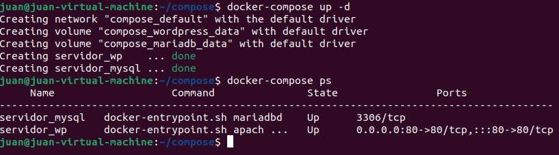

Por último comprobamos el despligue de la aplicación en nuestro navegador:

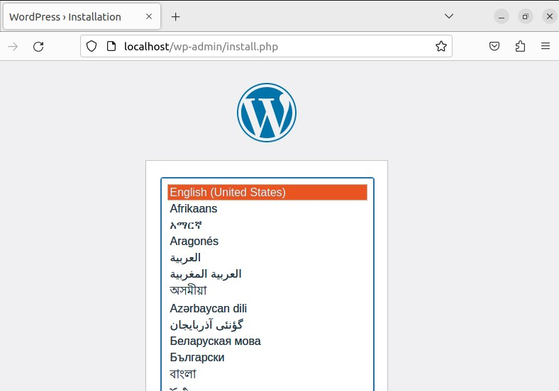

Luego para parar los contenedores:

```bash
$ docker-compose stop 
```

Y para eliminar el escenario:

```bash
$ docker-compose down
```

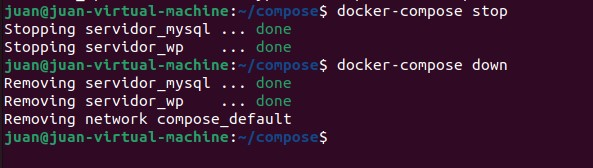


