#  PROYECTO SERVIDOR WEB JUAN FERNANDEZ SANCHEZ

## 1.- Instalación del servidor web apache. Usaremos dos dominios mediante el archivo hosts: centro.intranet y departamentos.centro.intranet. El primero servirá el contenido mediante wordpress y el segundo una aplicación en Python</a>

**Instalación Servidor Web Apache**

Antes de cualquier instalación, siempre es recomendable actualizar el sistema. 
```bash
sudo apt update 
```

```bash
sudo apt upgrade
```
Instalar servidor Apache.

```bash
sudo apt install apache2 
```
```bash
systemctl status apache2
```

Comprobamos escribiendo localhost en el navegador

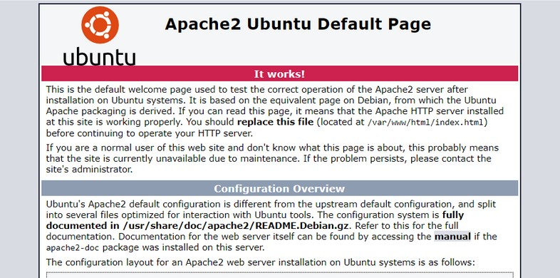

**MySql y PHP**

Instalación MySql

```bash
sudo apt install mysql-server
```

Comprobamos con:

```bash
mysql
```

Instalación PHP

```bash
sudo apt install php libapache2-mod-php php-mysql
```

Comprobar versión PHP instalada

```bash
php -v
```

**Configurar Dominios**

Para crear un dominio tenemos que dirigirnos al fichero **/etc/hosts**, una vez ahí, debemos poner nuestra ip local y el nombre del dominio que queremos crear, como en el siguiente ejemplo

```bash
sudo nano /etc/hosts
```

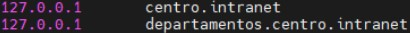

### 2. Instalación y Configuración de WordPress

Creamos directorio donde instalar nuestra página wordpress

```bash
sudo mkdir /var/www/html/mipagina
```

Creamos el archivo de configuración para nuestra página

```bash
sudo nano /etc/apache2/sites-available/centro.intranet.conf
```


```apache
<VirtualHost *:80>
  ServerName centro.intranet
  ServerAlias centro.intranet
  ServerAdmin webmaster@localhost
  DocumentRoot /var/www/html/mipagina
  
<Directory /var/www/html/mipagina/>
  AllowOverride All
</Directory>

ErrorLog ${APACHE_LOG_DIR}/mipagina_error.log
CustomLog ${APACHE_LOG_DIR}/mipagina_access.log combined
</VirtualHost>
```

Comprobamos que hemos creado correctamente el archivo de configuración y reinicamos Apache.

```bash
a2ensite centro.intranet
```
```bash
apache2ctl configtest
```
```bash
systemctl restart apache2
```

Ahora, entramos en Mysql

```bash
mysql
```
Creamos una base de datos **mibasedatos**

```mysql
CREATE DATABASE mibasedatos DEFAULT CHARACTER SET utf8 COLLATE utf8_unicode_ci;
```

Creamos el admin **admin** y le asignamos permisos.

```mysql
CREATE USER 'admin'@'%' IDENTIFIED WITH mysql_native_password BY '1234';
```

```mysql
GRANT ALL ON mibasedatos.* TO 'admin'@'%';
```
```mysql
FLUSH PRIVILEGES;
```

```mysql
exit;
```

Necesitaremos instalar los siguientes módulos php para crear nuestra página

```bash
sudo apt install curl php-curl php-gd php-mbstring php-xml php-xmlrpc php-soap php-intl php-zip -y
```

```bash
systemctl restart apache2
```

Instalación Wordpress, lo haremos en un directorio temporal y luego copiaremos a nuestro directorio definitivo previamente creado 

```bash
cd /tmp
```
```bash
sudo curl -O https://wordpress.org/latest.tar.gz
```
```bash
tar xzvf latest.tar.gz
```
```bash
touch /tmp/wordpress/.htaccess
```
```bash
cp /tmp/wordpress/wp-config-sample.php /tmp/wordpress/wp-config.php
```
```bash
mkdir /tmp/wordpress/wp-content/upgrade
```
Una vez hecha la instalación, copiamos toda la configuración a nuestro directorio inicial para nuestra página

```bash
sudo cp -a /tmp/wordpress/. /var/www/html/mipagina
```

Luego aplicamos permisos

```bash
sudo chown -R www-data:www-data /var/www/html/mipagina
sudo find /var/www/html/mipagina -type d -exec chmod 750 {} \;
sudo find /var/www/html/mipagina -type f -exec chmod 640 {} \;
```

Generamos unas claves necesarios para el funcionamiento de Wordpress

```bash
curl -s https://api.wordpress.org/secret-key/1.1/salt/
```

```bash
define('AUTH_KEY','XCg6.;1>5A@w!%?:M[+.;SyD?U030|iv^*]D2dR-`@GL82_C*Yv^$aQ6}dg)IeFi');
define('SECURE_AUTH_KEY','G=vlH7{ZBy6!7(PJ{S4<F~Doo_wS67]4,sN;-k@&-R%QWa$/SHr|BEZDGm;5LC~#');
define('LOGGED_IN_KEY','$[Cooii&tfwggfy+]#JT8I;;oh9u*CQTDwTazhzn[9]mfBu,@YR]bz!0]W|Swsx');
define('NONCE_KEY','ubu]6N0Z%sJ~e(<M+ODOR|J[6ZprN}6C]]nPxq72P{fBB+RZ9!98;zsak8tJt-H');
define('AUTH_SALT','alo^Wpd72|eZ|M+MBxqC/;VdsFFS${*q2bc@hpU0=;,,~0Dn1H8YD4eYO|at-1');
define('SECURE_AUTH_SALT','F>E!OTTZ-5T+Qj4+15r?huI(>CS@vin]tj1zSr0*TAtn~Zzk:SB3+erZV GDV^');
define('LOGGED_IN_SALT','pa^5zh1/[k=[N{57*KjiP4esb-UtGpV*ziVk-d,3loJ[m]u;u%7k#xPR%Pb+N((');
define('NONCE_SALT','04M1C(0;010;jhXj(;4p5zx0s;;az^D00;P91Ycwuez'sh@&c<0)[_AP7B$!t8');
```

Vamos a **wp-config.php** para establecer la base de datos creada en los apartados anteriores

```bash
define('DB_NAME','mibase');
define('DB_USER','admin');
define('DB_PASSWORD','1234');
define('DB_HOST','localhost');
define('FS_METHOD','direct');
```


Comprobamos la instalación correcta de Wordpress desde el directorio donde empezamos la instalación, centro.intranet 

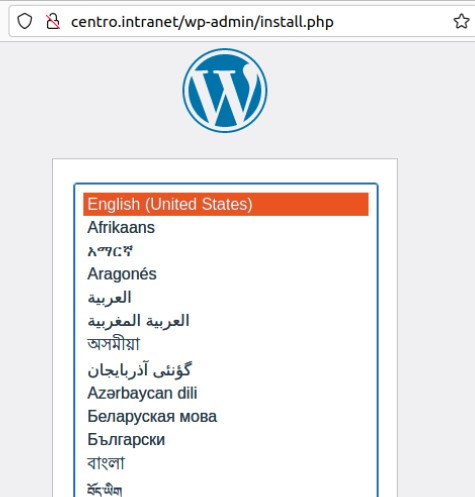

Desde aquí, ya solo tendríamos que seguir los pasos tras elegir lenguaje, donde nos pedirán crear unas credenciales y el título de nuestra nuevo proyecto worpress. 

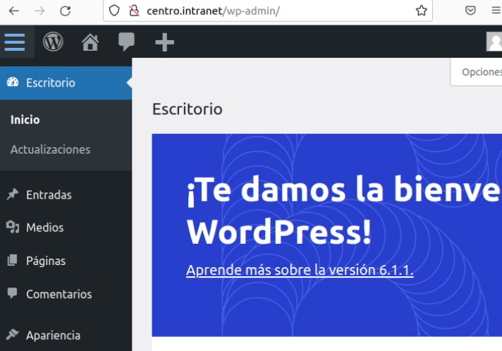

### 3. Python 

Activar el módulo “wsgi” para permitir la ejecución de aplicaciones Python

```bash
sudo apt install libapache2-mod-wsgi-py3
```
```bash
a2enmod wsgi
```

**Despligue de aplicación python**

Instalación python

```bash
sudo apt install python3 libexpat1 -y
```
```bash
sudo apt install apache2 apache2-utils ssl-cert libapache2-mod-wsgi-py3 -y
```

Creamos nuestra aplicación python **miapp.py**

```bash
sudo nano /var/www/html/mipaginapython/miapp.py
```

```python
def application(environ, start_response):
    status = '200 OK'
    output = b'Hola mundo'
    response_headers = [('Content-type', 'text/plain'),
                        ('Content-Length', str(len(output)))]
    start_response(status, response_headers)
    return [output]
```

Asignamos permisos:

```bash
sudo chown www-data:www-data /var/www/html/mipaginapython/miapp.py
sudo chmod 775 /var/www/html/mipaginapython/miapp.py
```

Configuramos wsgi, creando un nuevo virtual host y copiando el contenido de nuestro actual **000-default.conf**

```bash
cp /etc/apache2/sites-available/000-default.conf /etc/apache2/sites-available/mipaginapython.conf
```

Añadimos lo siguiente a nuestro archivo de configuración

```apache
ServerName departamentos.centro.intranet
ServerAlias departamentos.centro.intranet
DocumentRoot /var/www/html/mipaginapython/
WSGIScriptAlias /juanPython /var/www/html/mipaginapython/miapp.py
```

Como siempre, trans establecer nuevas configuraciones, reiniciamos el servidor apache. 

```bash
systemctl restart apache2
```

Accedemos para comprobar:


**Adicionalmente protegeremos el acceso a la aplicación python mediante autenticación**

Como con toda autenticación, necesitaremos unas credenciales

```bash
htpasswd -c /etc/apache2/.htpasswd juan
```

Tras establecer el usuario, añadimos en **mipaginapython.conf** :

```apache
<Directory /var/www/html/mipaginapython>
    AuthType Basic
    AuthName "Area de Seguridad - Autenticación requerida"
    AuthUserFile /etc/apache2/.htpasswd
    Require user juan 1234
</Directory>
```

```bash
systemctl restart apache2
```

Ahora, cuano accedemos a nuestra página, nos pedirá autentificarnos

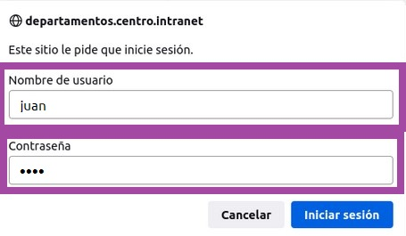


### 4. Instalación y Configuración de AWStats

```bash
sudo apt install awstats
```

```bash
a2enmod cgi
```

Creación de archivo de configuración para nuestra web **centro.intranet**

```bash
sudo cp /etc/awstats/awstats.conf /etc/awstats.centro.intranet.conf
```

```bash
sudo nano /etc/awstats.centro.intranet.conf
```

```apache
SiteDomain="centro.intranet"
```

Nombre de dominio:

```apache
HostAliases="www.centro.intranet localhost 127.0.0.1"
```

Permitimos recargar estadísticas

```apache
AllowToUpdateStatsFromBrowser=1
```

Establecemos las estadísticas iniciales, partiendo de las de nuestro servidor

```bash
sudo /usr/lib/cgi-bin/awstats.pl -config=centro.intranet -update
```

```bash
sudo cp -r /usr/lib/cgi-bin /var/www/html/
```

Asignamos permisos

```bash
sudo chown www-data:www-data /var/www/html/cgi-bin/
sudo chmod -R 755 /var/www/html/cgi-bin/
```

Ya tendriamos AWStats configurado. Si queremos acceder: localhost/cgi-bin

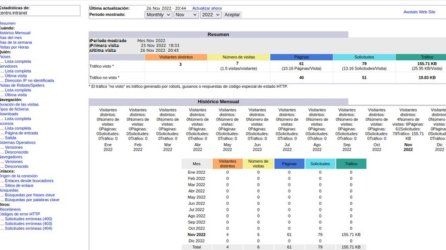

Accedemos a el fichero **/etc/crontab** y ponemos la siguiente linea para que las estadiscticas se actualicen frecuentemente.

```apache
*/10 * * * * * root /usr/lib/cgi-bin/awstats.pl -config=test.com -update
```

### 5. Instala un segundo servidor de tu elección (nginx, lighttpd) bajo el dominio “servidor2.centro.intranet”. Debes configurarlo para que sirva en el puerto 8080 y haz los cambios necesarios para ejecutar php. Instala phpmyadmin.

**Instalación Servidor Nginx**

```bash
sudo apt install nginx
```

Comprobamos la instalación con:

```bash
systemctl status nginx
```

Accedemos a localhost y deberiamos tener un pantalla como esta

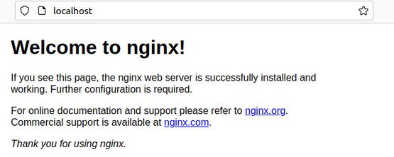

**Cambiamos el puerto**

```bash
sudo nano /etc/nginx/sites-availables/default
```

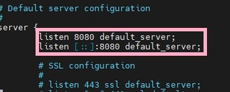

Reiniciamos para establecer configuración

```bash
systemctl restart nginx
```

Asignamos un dominio a nuestro servidor:

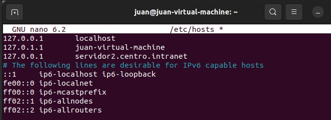

Ahora podemos acceder a nuestro servidor a través del dominio 

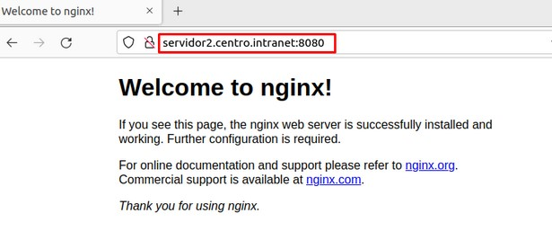


**Instalación de phpmyadmin**

```bash
sudo apt install php libapache2-mod-php php-mysql
```

Comprobamos instalación php

```bash
php -v
```

Instalamos phpmyadmin

```bash
apt install phpmyadmin php-mbstring php-zip php-gd php-json php-curl
```

Nos saltará una pantalla de configuración de paquetes por si queremos reinstalar la base de datos para phpmyadmin

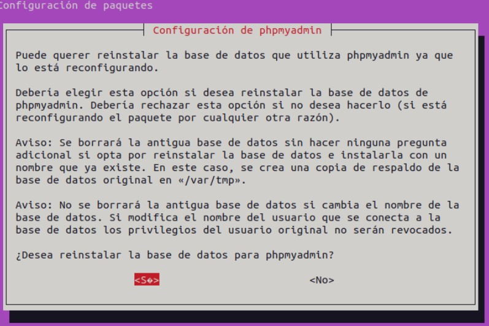

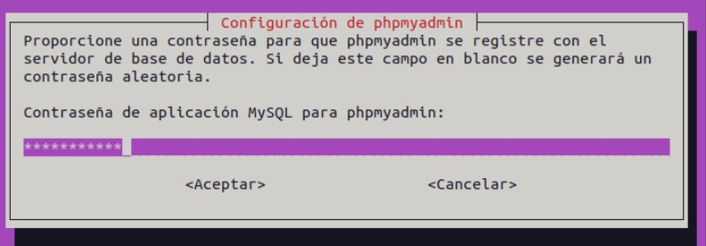

Generamos una clave segura

```bash
openssl rand -base64 32
```

Accedemos al archivo de configuracion

```bash
sudo nano /var/www/phpmyadmin/config.inc.php
```

Editamos **blowfish_secret** y establecemos la clave segura generada anteriormente 
Editamos **Servers** y establecemos localhost

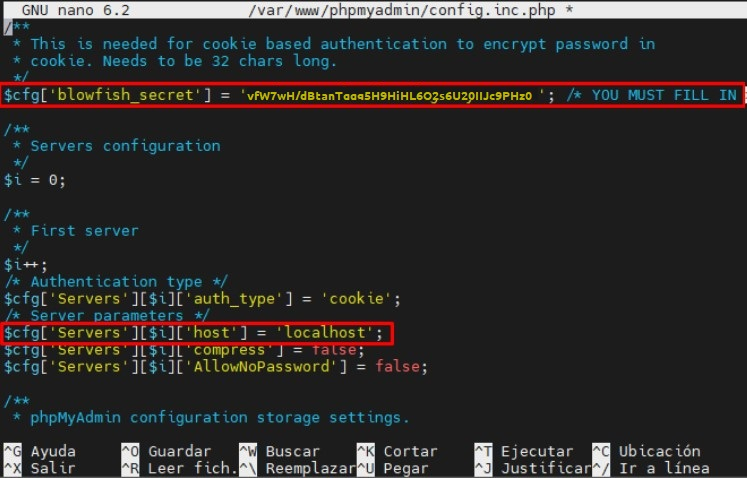

Cambiamos el puerto al mismo de nuestro servidor Nginx y el dominio en **/etc/nginx/sites-available/phpmyadmin**

```bash
sudo nano /etc/nginx/sites-available/phpmyadmin
```

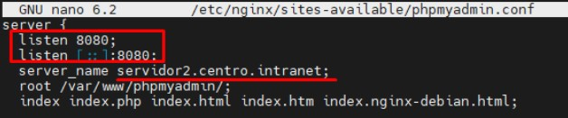

Al acceder a http://servidor2.centro.intranet:8080 ya nos saldrá el login de phpMyAdmin

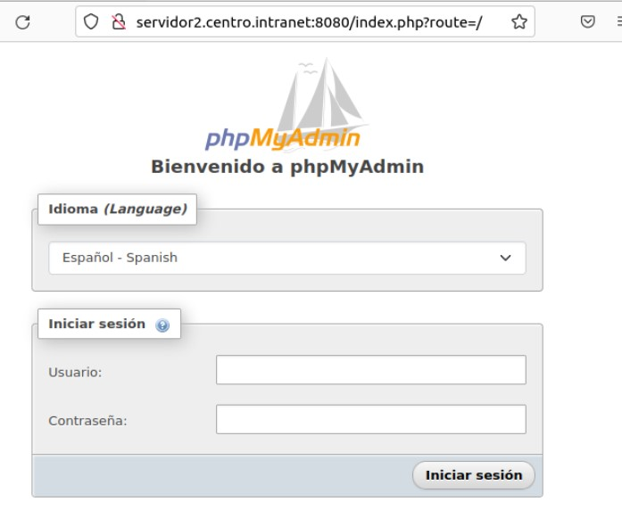

De momento no podemos acceder, así que procederemos a crear nuestras credenciales

```mysql
CREATE USER 'userJuan'@'localhost' IDENTIFIED BY 'admin';
```

```mysql
GRANT ALL PRIVILEGES ON *.* TO 'userJuan'@'localhost';
```

```mysql
exit
```

Ya podemos acceder a phpMyAdmin con nuestras credenciales

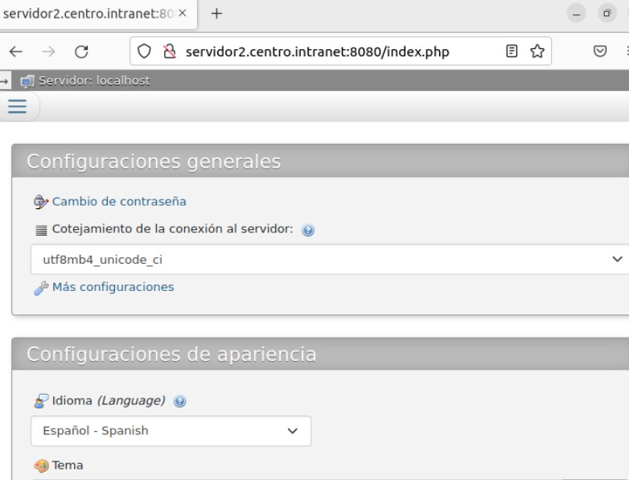
